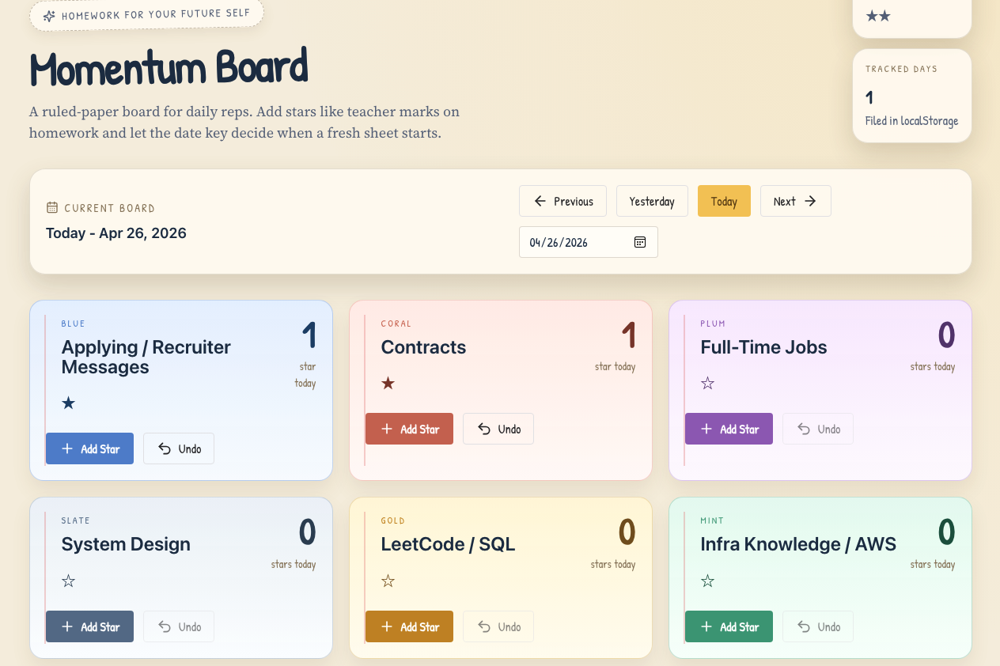

# Momentum Board

Momentum Board is a local-first daily tracking app for directional progress. It is not a task manager. It is a lightweight board that answers one question quickly: did today move in the right direction?

## What It Does

- Tracks star counts per category per date
- Uses the current local date as the active board key
- Lets you move between today, yesterday, and adjacent days
- Persists everything in `localStorage`
- Supports adding and removing categories without breaking saved data
- Uses a paper / homework visual theme

## Data Model

Stars are stored under a date key:

```json
{
  "2026-04-26": {
    "job-applications": 2,
    "leetcode-sql": 1,
    "trading-review": 1
  }
}
```

This keeps each day independent. At midnight, the app simply points at a new key such as `2026-04-27`, so the new board starts blank without a reset job.

## Default Categories

The starter set is deduped from the planning notes and normalized into momentum lanes:

- Applying / Recruiter Messages
- Contracts
- Full-Time Jobs
- System Design
- LeetCode / SQL
- Infra Knowledge / AWS
- Portfolio / GitHub / Resume / LinkedIn
- Outreach / Networking
- Volunteer / Develop for Good
- Startup Outreach
- Startup Pitching
- Startup Research
- Startup Prototype
- YouTube Upload
- Trading / Investing / Market Prep
- Health
- Chores / Life Admin
- Reflection / Planning

You can add more categories in the UI at any time.

## Stack

- React
- TypeScript
- Vite
- Chakra UI
- `localStorage`
- Netlify-ready static build

## Local Development

1. Install dependencies:

```bash
npm install
```

2. Start the dev server:

```bash
npm run dev
```

3. Build for production:

```bash
npm run build
```

Netlify is configured to publish `dist/client` with an SPA fallback in [netlify.toml](netlify.toml).

## Project Structure

- [src/client/pages/Home.tsx](src/client/pages/Home.tsx): main board page and state orchestration
- [src/client/features/momentum/storage.ts](src/client/features/momentum/storage.ts): localStorage model, category defaults, date helpers
- [src/client/features/momentum/components.tsx](src/client/features/momentum/components.tsx): board UI sections
- [src/client/features/momentum/palette.ts](src/client/features/momentum/palette.ts): theme palette and surface styles
- [src/client/ui/styles/index.css](src/client/ui/styles/index.css): global paper-theme styling

## Notes

- Removing a category also removes its stored star counts from every day.
- Undo now works down to zero stars for a category.
- The app is intentionally backend-free for fast iteration and cheap deployment.
